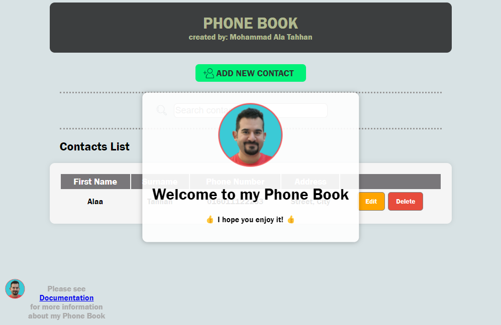

# Phone Book by Alaa Tahhan



This is a dynamic Phone Book application that allows users to manage their contact list with ease. The interface supports adding, editing, and deleting contact details along with a search functionality for quick navigation.<br>
[Click Here to View Demo](https://phonebook-alaa.netlify.app/)

## 🌟 Features

- 📱 **Contact Management:** Easily add, update, or delete contacts.
- 🔍 **Search Functionality:** Instantly search through contacts by first or last name as you type.
- 🚨 Warning Messages: Users will receive confirmation messages for any contact modification:
  - ✅ <span style="color:green; font-weight:bold">Adding</span>
  - ✍️ <span style="color:orange; font-weight:bold">Updating</span>
  - ❌ <span style="color:red; font-weight:bold">Deleting</span>
- 🔄 **Dynamic Updated Contact List:** Real-time updating of the contact list without needing to refresh the page.

## 🛡️ Data Storage and Privacy

- <span style="font-weight:bold">🏠 Local Storage:</span> All contacts are stored directly on your device, ensuring your privacy.
- <span style="font-weight:bold">🔒 No External Servers:</span> No data is sent to or stored on external servers.
- <span style="font-weight:bold">🖥️ Device Dependent:</span> If you switch browsers or devices, you will not see your saved contacts. Contacts remain accessible only on the original browser or device where they were saved, as they are not transferred or shared.

## 🛠️ Tech Stack

### Frontend Technologies

<div align="left">

<table>
  <tr>
    <td align="center"><br>HTML5</td>
    <td align="center"><br>CSS3</td>
    <td align="center"><br>JavaScript</td>
    <td align="center"><br>jQuery</td>
  </tr>
</table>

</div>

## ⚙️ Setup and Installation

1. **Clone the repository:**
   ```bash
   git clone https://github.com/SoftwareEngineerAlaa/phone-book.git
   ```
2. **Navigate to the project directory:**
   ```bash
   cd phone-book
   ```
3. **Open the application:**
   ```bash
   open index.html
   ```
   This will open the Phone Book in your default web browser.

## 📖 Usage

Start by adding a new contact using the 'ADD NEW CONTACT' button. Fill in the contact details and save. You can search for existing contacts using the search bar and edit or delete contacts as needed.

## 🚀 Possible Developments

- 📖 Option to categorize contacts (e.g., Family, Friends, Work).
- 📅 Integration with calendar for birthday reminders.
- 📲 Export and import contacts to and from various formats.
- 🔒 Enhance security measures for sensitive contact information.
- 🌐 Multi-language support to cater to a global user base.

## 🤝 Contribution

Contributions are welcome! If you'd like to contribute to the Phone Book project, please fork the repository and submit a pull request. All contributions submitted to this project will remain under your copyright. Additionally, the project is open-sourced under the MIT License, allowing others to freely use, modify, and distribute your contributions under the same license.

## 📞 Developer Contact

**Alaa Tahhan**

- [Portfolio](https://alaatahhan.netlify.app/)
- [GitHub](https://github.com/SoftwareEngineerAlaa)
- [LinkedIn](https://www.linkedin.com/in/mohammad-ala-tahhan/)

Thank you for trying the Phone Book!
